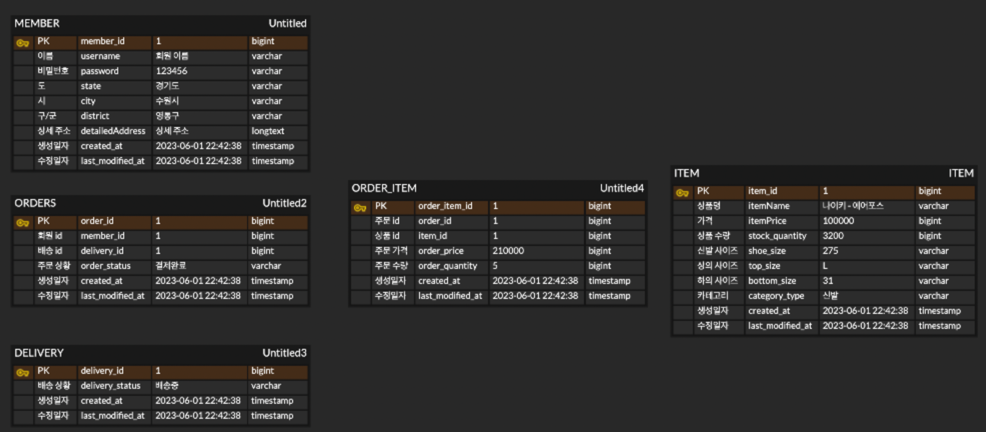
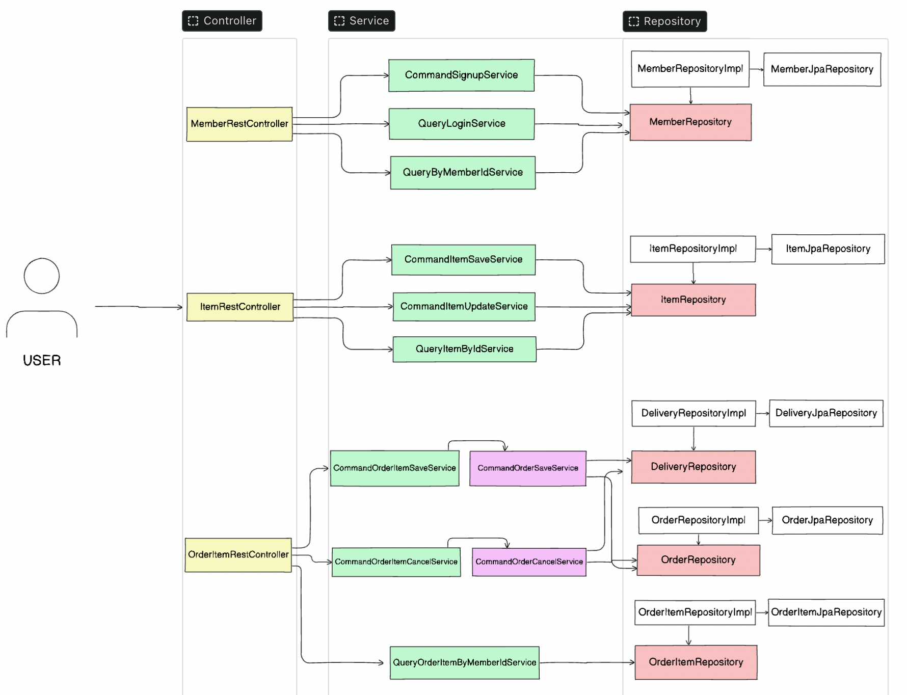

# 의존성을 최소화하는 주문 시스템 설계

주문 시스템 설계시 의존성을 최소화 하기위해 다음 조건을 만족하도록 설계

1. 도메인과 Jpa 엔티티를 분류
2. FK를 사용하지 않고 Jpa 연관관계를 사용하지 않음
3. Repository를 추상화함
   - Service 계층은 xxxRepository에만 의존하고 xxxRepositoryImpl는 xxxRepository를 구현 
   - xxxRepositoryImpl은 xxxJpaRepository, JpaQueryFactory를 주입
4. Service 계층에서 유즈케이스에 따라 클래스를 나눔   

## Context

### 회원
- 회원가입, 로그인 
    - 쿠키, 세션 기반으로 Spring Interceptor와 ArgumentResolver를 결합하여 구현   
    - 로그인이 필요한지는 인터셉터로 확인하고 회원의 정보를 가져올 필요가 있을 때는 ArgumentResolver를 사용
- 회원 조회

### 상품
- 상품 등록, 수정, 삭제

### 주문
- 상품 주문, 주문 상황 조회, 주문 취소

## Challenge

- 비즈니스 로직이 복잡해질 수록 Service 계층에서 의존하는 클래스가 많아짐
    - 서비스의 메소드들을 유즈케이스로 나눠 각 클래스로 만듦
- Jpa 연관관계 0 코딩
     - 각각 id로 가져온 후 결합하거나 조인하여 dto로 가져옴

## Todo

- 유즈케이스로 최대한 분리할 때 서로 참조해야할 경우가 생김
    - 퍼사드로 분류하여 처리하는 것 고려

## Table-Architecture

실전 스프링부트와 JPA 활용 1편(인프런 - 김영한)의 테이블 설계를 변형하였습니다.    

## Overall-Architecture

